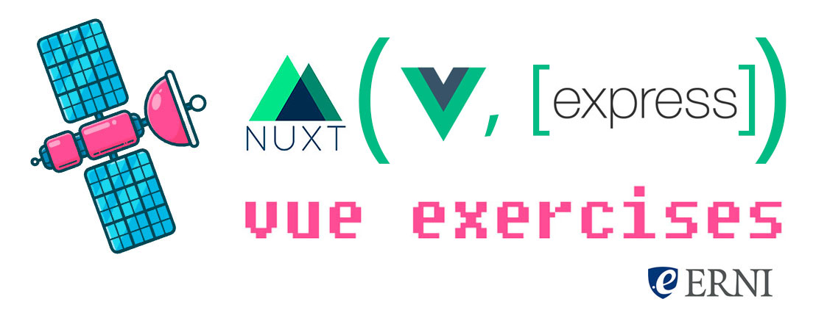

  

# vue-exercises

## Why Nuxt?

[Nuxt](https://nuxtjs.org) is a framework to make universal Vue apps. It comes with a lot of [flavours](https://github.com/nuxt-community/awesome-nuxt) our you can make your own. It will gives us a lot of [features](https://nuxtjs.org/guide#features) by default (that we can also configure) and extend with its plugin system.

## Instructions to get started

> Vue exercises made within a Nuxt.js application. 4 Exercises for the astronaut cadets of Erni!

* Clone the repository wherever you want in your computer: `git clone https://github.com/gangsthub/vue-exercises.git`

* Install the dependencies: `npm install` within the _vue-exercises_ folder.

* Open the app in your editor of choice.

  - I personally recommend [VS Code](https://code.visualstudio.com/download) with [Vetur Extension](https://marketplace.visualstudio.com/items?itemName=octref.vetur) installed.

* Launch it with: `npm run dev` 💪🏾🚀🛫

* Your browser will open in [localhost:3000](http://localhost:3000). (Refresh it the firt time if just a blank page appears.)

* Follow the steps supplied in the app's homepage.

For detailed explanation on how these things work, checkout the [Nuxt.js docs](https://github.com/nuxt/nuxt.js).

## Components Library

We are using [Vuetifyjs](https://vuetifyjs.com) wich is a [Material Design](http://material.io/) components library for Vue.

## Animations

For the animations I'm using vue's core own capabilities and CSS. I also added [Popmotion](https://popmotion.io) for some other more complex animations.

## Credits

- Satellite illustration By [Outlane](https://gumroad.com/l/flying-objects)
- Astronaut illustration by [dDara](https://thenounproject.com/dDara/collection/aerospace-and-astronomy/?i=1616385)
- Fonts used:

  - [Roboto](https://fonts.google.com/specimen/Roboto)
  - [Montserrat](https://github.com/JulietaUla/Montserrat)
  - Icon Fonts: [Material Icons](http://material.io/icons)

## Thanks

- Thanks to Erni for letting us do this workshops.
- Thanks to the contributors/organizers: Ana Jaime, Jorge Artieda, Bernat Martinez.
