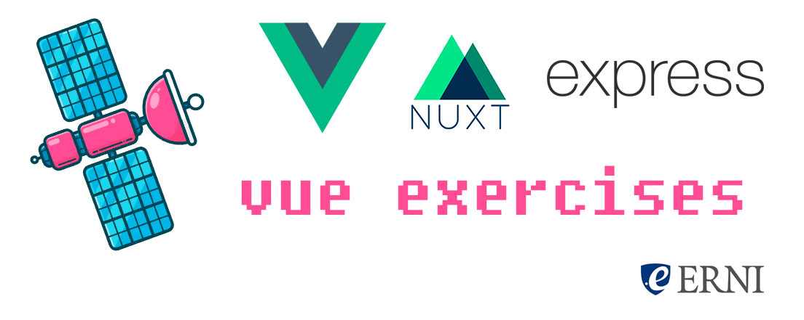

  

# vue-exercises

> Vue exercises made within a Nuxt.js application. 4 Exercises for the astronaut cadets of Erni!

* Clone the repository

* Install the dependencies: `npm install`

* Open the app in your editor.

* Launch it: `npm run dev`

* Open your browser in (localhost:300)[http://localhost:300]

For detailed explanation on how things work, checkout the [Nuxt.js docs](https://github.com/nuxt/nuxt.js).

## Components Library

We are using [Vuetifyjs](https://vuetifyjs.com) wich is a [Material Design](http://material.io/) components library for Vue.

## Animations

For the animations I'm using vue's core own capabilities and CSS. I also added [Popmotion](https://popmotion.io) for some other more complex animations.

## Credits

- Satellite illustration By [Outlane](https://gumroad.com/l/flying-objects)
- Astronaut illustration by [dDara](https://thenounproject.com/dDara/collection/aerospace-and-astronomy/?i=1616385)
- Fonts used:

  - [Roboto](https://fonts.google.com/specimen/Roboto)
  - [Montserrat](https://github.com/JulietaUla/Montserrat)
  - Icon Fonts: [Material Icons](http://material.io/icons)